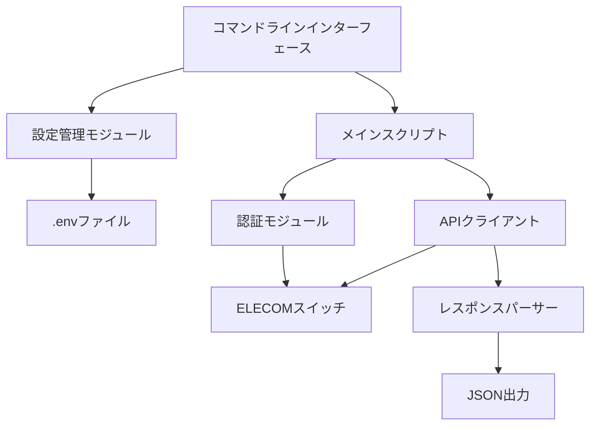
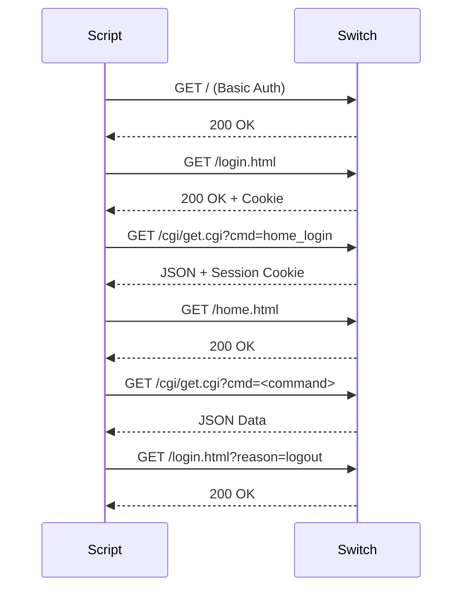

# 設計ドキュメント

## 概要

ELECOM EHB-SQ2A08スイッチングハブ管理スクリプトは、ネットワーク管理者がELECOMスイッチングハブから情報を取得し、セッションを管理するためのPythonベースのコマンドラインツールです。

### 主要機能

- スイッチへのHTTP Basic認証
- 複数スイッチの個別設定ファイル管理
- ポートステータス、VLAN、MACアドレステーブル、トラフィック統計の取得
- JSON形式でのデータ出力
- セッション管理とクリーンアップ

### 設計目標

1. **セキュリティ**: 認証情報を環境ファイルで安全に管理
2. **使いやすさ**: 直感的なコマンドラインインターフェース
3. **拡張性**: 複数スイッチの管理をサポート
4. **信頼性**: エラーハンドリングとセッション管理
5. **保守性**: モジュール化された設計

## アーキテクチャ

### システム構成



### レイヤー構造

1. **プレゼンテーション層**: コマンドライン引数の解析、ヘルプメッセージ、JSON出力
2. **ビジネスロジック層**: 設定管理、認証、APIリクエスト構築、レスポンス処理
3. **インフラストラクチャ層**: HTTP通信、Cookie管理、環境ファイル読み込み

## コンポーネントとインターフェース

### 1. メインスクリプト (get_elecom_swhub_info.py)

#### 責務
- コマンドライン引数の解析
- 設定の読み込みと検証
- スイッチデータの取得オーケストレーション
- JSON出力のフォーマット

#### 主要関数

**main()**
- 引数: なし
- 戻り値: なし
- 説明: エントリーポイント。コマンドライン引数を解析し、データ取得を実行

**load_env_file(env_file: str) -> dict**
- 引数: env_file - 環境ファイルのパス
- 戻り値: 環境変数の辞書
- 説明: .envファイルを読み込み、KEY=VALUE形式をパース

**get_config_value(arg_value: str, env_file_value: str) -> str**
- 引数: arg_value - コマンドライン引数の値, env_file_value - 環境ファイルの値
- 戻り値: 優先順位に従った設定値
- 説明: コマンドライン引数 > 環境ファイルの優先順位で設定値を返す

**get_switch_data(switch_url: str, username: str, password: str, commands_to_fetch: list, get_all_port_traffic: bool) -> dict**
- 引数: 
  - switch_url - スイッチのURL
  - username - ユーザー名
  - password - パスワード
  - commands_to_fetch - 取得するAPIコマンドのリスト
  - get_all_port_traffic - 全ポートのトラフィック統計を取得するかどうか
- 戻り値: 取得したデータの辞書
- 説明: スイッチに認証し、指定されたデータを取得

### 2. セッション切断ユーティリティ (disconnect_all_sessions.py)

#### 責務
- スイッチセッションの強制切断
- セッション制限エラーからの回復

#### 主要関数

**disconnect_session(switch_url: str, username: str, password: str) -> None**
- 引数: switch_url, username, password
- 戻り値: なし
- 説明: スイッチにログインして即座にログアウトし、セッションを切断

### 3. 設定管理

#### 環境ファイル形式
```
SWITCH_IP=192.168.1.1
SWITCH_USER=admin
SWITCH_PASSWORD=password
```

#### 設定の優先順位
1. コマンドライン引数 (--ip, --user, --password)
2. 環境ファイル (--env-fileで指定、デフォルト: .env)

### 4. HTTP通信モジュール

#### 認証フロー


#### HTTPヘッダー
- **Authorization**: Basic認証ヘッダー (Base64エンコード)
- **User-Agent**: ブラウザを模倣
- **Accept**: application/json, text/javascript, */*; q=0.01
- **X-Requested-With**: XMLHttpRequest (AJAX リクエストを示す)
- **Referer**: 適切なリファラーURL
- **Accept-Language**: ja,en-US;q=0.9,en;q=0.8
- **Accept-Encoding**: gzip, deflate
- **Connection**: keep-alive

#### Cookie管理
- `http.cookiejar.CookieJar`を使用してセッションCookieを自動管理
- `urllib.request.HTTPCookieProcessor`でCookieを自動的に送受信

### 5. APIエンドポイント

#### 利用可能なエンドポイント

| コマンド | エンドポイント | 説明 |
|---------|--------------|------|
| home_login | /cgi/get.cgi?cmd=home_login | ログイン・セッション確立 |
| panel_info | /cgi/get.cgi?cmd=panel_info | ポートステータス |
| port_port | /cgi/get.cgi?cmd=port_port | ポート設定 |
| panel_layout | /cgi/get.cgi?cmd=panel_layout | パネルレイアウト |
| vlan_port | /cgi/get.cgi?cmd=vlan_port | VLANポート設定 |
| vlan_conf | /cgi/get.cgi?cmd=vlan_conf | VLAN設定 |
| vlan_membership | /cgi/get.cgi?cmd=vlan_membership | VLANメンバーシップ |
| mac_dynamic | /cgi/get.cgi?cmd=mac_dynamic | ダイナミックMACテーブル |
| mac_static | /cgi/get.cgi?cmd=mac_static | スタティックMACテーブル |
| port_cnt | /cgi/get.cgi?cmd=port_cnt&port=<PORT> | ポートトラフィック統計 |
| home_main | /cgi/get.cgi?cmd=home_main | スイッチ基本情報 |

#### APIリクエストパラメータ
- **cmd**: コマンド名
- **dummy**: タイムスタンプ (キャッシュ回避用)
- **port**: ポート名 (port_cntコマンドのみ)

#### タイムアウト設定
- すべてのHTTPリクエストに10秒のタイムアウトを設定
- ログアウトリクエストは5秒のタイムアウト

## データモデル

### ポート定義
```python
PORTS = ["GE1", "GE2", "GE3", "GE4", "GE5", "GE6", "GE7", "GE8", 
         "LAG1", "LAG2", "LAG3", "LAG4"]
```
- GE1-GE8: 物理ポート
- LAG1-LAG4: リンクアグリゲーショングループ

### コマンド定義
```python
AVAILABLE_COMMANDS = {
    'status': [('panel_info', 'ポートステータス')],
    'port': [('port_port', 'ポート設定'), ('panel_layout', 'パネルレイアウト')],
    'vlan': [('vlan_port', 'VLANポート設定'), ('vlan_conf', 'VLAN設定'), 
             ('vlan_membership', 'VLANメンバーシップ')],
    'mac': [('mac_dynamic', 'ダイナミックMACアドレステーブル'), 
            ('mac_static', 'スタティックMACアドレステーブル')],
    'main': [('home_main', 'スイッチ基本情報')],
}
```

### レスポンスデータ構造

#### 成功時
```json
{
  "panel_info": { /* APIレスポンスデータ */ },
  "port_port": { /* APIレスポンスデータ */ },
  "port_traffic_all": {
    "GE1": { /* トラフィック統計 */ },
    "GE2": { /* トラフィック統計 */ },
    ...
  }
}
```

#### エラー時
```json
{
  "panel_info": {
    "error": "Authentication failed or no data"
  },
  "error": "Connection timeout"
}
```

### 環境変数データ構造
```python
{
  "SWITCH_IP": "192.168.1.1",
  "SWITCH_USER": "admin",
  "SWITCH_PASSWORD": "password"
}
```


## 正確性プロパティ

プロパティとは、システムのすべての有効な実行において真であるべき特性または動作です。本質的には、システムが何をすべきかについての形式的な記述です。プロパティは、人間が読める仕様と機械で検証可能な正確性保証との橋渡しとなります。

### プロパティ1: 環境ファイルのパース

任意の有効な環境ファイル（KEY=VALUE形式の行を含む）に対して、`load_env_file`関数は各行を正しくパースし、キーと値のペアを辞書として返すべきである。

**検証要件: 1.1**

### プロパティ2: 設定の優先順位

任意のコマンドライン引数値と環境ファイル値の組み合わせに対して、`get_config_value`関数はコマンドライン引数が指定されている場合はそれを返し、そうでない場合は環境ファイルの値を返すべきである。

**検証要件: 1.2**

### プロパティ3: 認証情報の検証

任意の認証情報の組み合わせ（IP、ユーザー名、パスワード）に対して、いずれかが欠けている場合、スクリプトはエラーメッセージを表示して終了すべきである。

**検証要件: 1.3**

### プロパティ4: HTTP Basic認証ヘッダー生成

任意のユーザー名とパスワードの組み合わせに対して、認証ヘッダーは`Basic <Base64エンコードされた"username:password">`の形式で正しく生成されるべきである。

**検証要件: 1.4, 15.1**

### プロパティ5: HTTPヘッダーの完全性

任意のAPIリクエストに対して、必須のHTTPヘッダー（User-Agent、X-Requested-With、Referer、Accept）がすべて適切に設定されるべきである。

**検証要件: 15.3, 15.4, 15.5**

### プロパティ6: タイムスタンプパラメータの付加

任意のAPIエンドポイント呼び出しに対して、URLにはキャッシュ回避用のタイムスタンプパラメータ（dummy）が含まれるべきである。

**検証要件: 15.6**

### プロパティ7: JSON出力の有効性

任意のデータ構造（取得したスイッチデータ、エラー情報）に対して、出力は有効なJSON形式でシリアライズされ、日本語文字が正しく表示される（ensure_ascii=False）べきである。

**検証要件: 3.5, 4.4, 5.5, 6.4, 7.7, 8.5, 9.3, 10.3**

### プロパティ8: APIレスポンスのパース

任意の有効なJSONレスポンスに対して、スクリプトは正しくパースし、指定されたフィールド（リンク状態、速度、デュプレックスモード、VLAN情報、MACアドレス、トラフィック統計など）を抽出できるべきである。

**検証要件: 3.2, 3.3, 3.4, 4.2, 4.3, 5.2, 5.3, 5.4, 6.2, 6.3, 7.2, 7.3, 7.4, 7.5, 7.6, 8.2, 8.3, 8.4**

### プロパティ9: エラーハンドリングの一貫性

任意のAPI呼び出しエラー（認証失敗、JSONパースエラー、ネットワークタイムアウト）に対して、スクリプトはエラーメッセージをJSON構造に含め、他のデータ取得を続行すべきである。

**検証要件: 13.1, 13.5**

### プロパティ10: API呼び出し間の遅延

任意の連続するAPI呼び出しに対して、スクリプトは適切な遅延（0.2-0.5秒）を挿入し、スイッチへの負荷を軽減すべきである。

**検証要件: 11.4**

### プロパティ11: セッション切断の遅延

disconnect_all_sessions.pyにおいて、任意の連続するセッション切断試行に対して、各試行の間に1秒の遅延が挿入されるべきである。

**検証要件: 12.4**

### プロパティ12: 環境ファイルパスの柔軟性

任意の有効なファイルパスに対して、`--env-file`オプションで指定された環境ファイルが正しく読み込まれ、異なる環境ファイルから異なる接続情報が取得されるべきである。

**検証要件: 2.1, 2.4**


## エラーハンドリング

### エラーカテゴリ

#### 1. 設定エラー
- **原因**: 認証情報の不足、環境ファイルの不正な形式
- **処理**: エラーメッセージを表示してスクリプトを終了
- **例**: 
  ```
  接続情報が不足しています。--ip, --user, --password を指定するか、.envファイルを設定してください。
  ```

#### 2. 認証エラー
- **原因**: 無効な認証情報、スイッチへの接続失敗
- **処理**: エラーをJSON構造に含めて返す
- **例**: 
  ```json
  {
    "panel_info": {
      "error": "Authentication failed or no data"
    }
  }
  ```

#### 3. ネットワークエラー
- **原因**: タイムアウト、接続拒否、ネットワーク障害
- **処理**: エラーメッセージをJSON構造に含め、他のAPI呼び出しを続行
- **例**: 
  ```json
  {
    "port_port": {
      "error": "Connection timeout"
    }
  }
  ```

#### 4. パースエラー
- **原因**: 不正なJSONレスポンス、予期しないレスポンス形式
- **処理**: エラーをJSON構造に含めて返す
- **例**: 
  ```json
  {
    "vlan_conf": {
      "error": "JSON parse error"
    }
  }
  ```

#### 5. セッションエラー
- **原因**: セッション制限、同時接続数の超過
- **処理**: ログアウト失敗を無視して続行、disconnect_all_sessions.pyで回復
- **対策**: 
  - 各API呼び出し後に適切な遅延を挿入
  - データ取得完了後に必ずログアウト
  - セッション切断ユーティリティを提供

### エラーハンドリング戦略

#### 部分的失敗の許容
スクリプトは、一部のAPI呼び出しが失敗しても他のデータ取得を続行します。これにより、可能な限り多くの情報を取得できます。

```python
try:
    with opener.open(request, timeout=10) as response:
        content = response.read().decode('utf-8', errors='ignore')
        data = json.loads(content)
        result[cmd] = data
except json.JSONDecodeError:
    result[cmd] = {"error": "JSON parse error"}
except Exception as e:
    result[cmd] = {"error": str(e)}
```

#### ログアウトの確実性
ログアウトが失敗してもスクリプトは正常終了します。これにより、セッションクリーンアップの失敗がデータ取得の成功を妨げません。

```python
try:
    with opener.open(request, timeout=5) as response:
        pass
except:
    pass  # ログアウト失敗を無視
```

#### タイムアウト設定
すべてのHTTPリクエストにタイムアウトを設定し、無限待機を防ぎます。

- データ取得API: 10秒
- ログアウト: 5秒

### エラーリカバリ

#### セッション制限エラーからの回復
1. `disconnect_all_sessions.py`を実行
2. 3回のログイン・ログアウトサイクルでセッションをクリア
3. 各試行の間に1秒待機
4. 元のスクリプトを再実行

#### ネットワークエラーからの回復
1. スイッチへの接続を確認
2. ネットワーク設定を確認
3. スクリプトを再実行

## テスト戦略

### デュアルテストアプローチ

本プロジェクトでは、ユニットテストとプロパティベーステストの両方を使用して包括的なカバレッジを実現します。

#### ユニットテスト
特定の例、エッジケース、エラー条件を検証します。

**対象**:
- 特定の環境ファイル形式のパース
- 特定の認証情報の組み合わせ
- 既知のエラーケース（空の認証情報、不正なJSON）
- 統合ポイント（ログインフロー、ログアウト処理）

**例**:
```python
def test_load_env_file_with_comments():
    """コメント行を含む環境ファイルを正しくパースする"""
    # テストケース実装

def test_authentication_with_invalid_credentials():
    """無効な認証情報でエラーを返す"""
    # テストケース実装

def test_logout_failure_does_not_crash():
    """ログアウト失敗時にスクリプトが正常終了する"""
    # テストケース実装
```

#### プロパティベーステスト
すべての入力に対して成り立つ普遍的なプロパティを検証します。

**対象**:
- 環境ファイルのパース（任意の有効なKEY=VALUE形式）
- 設定の優先順位（任意の引数と環境変数の組み合わせ）
- JSON出力の有効性（任意のデータ構造）
- HTTPヘッダーの生成（任意の認証情報）

**プロパティベーステストライブラリ**: Hypothesis (Python)

**設定**:
- 各プロパティテストは最低100回の反復を実行
- ランダム化により広範な入力カバレッジを実現

**例**:
```python
from hypothesis import given, strategies as st

@given(st.text(), st.text())
def test_property_config_priority(arg_value, env_value):
    """
    Feature: elecom-switch-management, Property 2:
    任意のコマンドライン引数値と環境ファイル値の組み合わせに対して、
    get_config_valueはコマンドライン引数が指定されている場合はそれを返し、
    そうでない場合は環境ファイルの値を返すべきである。
    """
    if arg_value:
        assert get_config_value(arg_value, env_value) == arg_value
    else:
        assert get_config_value(arg_value, env_value) == env_value

@given(st.dictionaries(st.text(), st.text()))
def test_property_json_output_validity(data):
    """
    Feature: elecom-switch-management, Property 7:
    任意のデータ構造に対して、出力は有効なJSON形式でシリアライズされ、
    日本語文字が正しく表示されるべきである。
    """
    json_str = json.dumps(data, ensure_ascii=False)
    parsed = json.loads(json_str)
    assert parsed == data
```

### テストカバレッジ目標

- **ユニットテスト**: 主要な関数とエッジケースをカバー
- **プロパティベーステスト**: 正確性プロパティをすべてカバー
- **統合テスト**: エンドツーエンドのワークフロー（モックスイッチを使用）

### テスト環境

#### モックスイッチ
実際のスイッチを使用せずにテストを実行するため、モックHTTPサーバーを使用します。

**機能**:
- HTTP Basic認証のシミュレーション
- Cookie管理のシミュレーション
- 各APIエンドポイントのレスポンスのシミュレーション
- エラーケース（タイムアウト、認証失敗）のシミュレーション

#### テストデータ
- 有効な環境ファイルのサンプル
- 無効な環境ファイルのサンプル
- 各APIエンドポイントのレスポンスサンプル
- エラーレスポンスのサンプル

### 継続的テスト

- すべてのコミット前にテストを実行
- CI/CDパイプラインでの自動テスト実行
- テスト失敗時のデプロイメント防止

## セキュリティ考慮事項

### 認証情報の保護

1. **環境ファイルの使用**
   - 認証情報を.envファイルに保存
   - .gitignoreに.envファイルパターンを追加
   - コマンドライン引数での認証情報指定を非推奨

2. **ファイルパーミッション**
   - .envファイルのパーミッションを600に設定
   - 所有者のみ読み書き可能

3. **バージョン管理**
   - .envファイルをバージョン管理システムにコミットしない
   - .env.exampleファイルのみをコミット

### 通信セキュリティ

1. **HTTP Basic認証**
   - Base64エンコードされた認証情報を使用
   - 注意: HTTP通信は暗号化されていない（HTTPSではない）
   - 信頼できるネットワークからのみアクセスを推奨

2. **セッション管理**
   - セッションCookieを適切に管理
   - データ取得完了後に必ずログアウト
   - セッション制限を考慮した遅延の挿入

### ベストプラクティス

1. 定期的なパスワード変更
2. 最小権限の原則（必要な権限のみを持つアカウントを使用）
3. アクセスログの監視
4. 複数スイッチの個別認証情報管理

## 実装の詳細

### 認証フロー実装

```python
# 1. HTTP Basic認証ヘッダーの生成
credentials = f"{username}:{password}"
encoded_credentials = base64.b64encode(credentials.encode()).decode()
auth_header = f"Basic {encoded_credentials}"

# 2. Cookieジャーの初期化
cookie_jar = http.cookiejar.CookieJar()
opener = urllib.request.build_opener(urllib.request.HTTPCookieProcessor(cookie_jar))

# 3. 認証シーケンス
# a. トップページにアクセス
# b. login.htmlにアクセス
# c. home_loginを呼び出してセッションCookieを取得
# d. home.htmlにアクセス
```

### API呼び出し実装

```python
# APIエンドポイントの構築
api_url = f"{switch_url}/cgi/get.cgi?cmd={cmd}&dummy={int(time.time() * 1000)}"

# リクエストの作成
request = urllib.request.Request(api_url)
for key, value in headers.items():
    request.add_header(key, value)

# レスポンスの処理
with opener.open(request, timeout=10) as response:
    content = response.read().decode('utf-8', errors='ignore')
    data = json.loads(content)
    result[cmd] = data
```

### トラフィック統計の取得

```python
# 全ポート（GE1-GE8 + LAG1-LAG4）のループ
for port in PORTS:
    api_url = f"{switch_url}/cgi/get.cgi?cmd=port_cnt&port={port}&dummy={int(time.time() * 1000)}"
    # API呼び出しとレスポンス処理
    result['port_traffic_all'][port] = data
```

### JSON出力実装

```python
# コンパクト形式（デフォルト）
print(json.dumps(result, ensure_ascii=False))

# 整形形式（--prettyオプション）
print(json.dumps(result, indent=2, ensure_ascii=False))
```

## 拡張性

### 新しいAPIエンドポイントの追加

1. `AVAILABLE_COMMANDS`辞書に新しいコマンドを追加
2. コマンドライン引数に新しいオプションを追加
3. ドキュメントを更新

### 新しいスイッチモデルのサポート

1. スイッチ固有のAPIエンドポイントを調査
2. 必要に応じてAPIクライアントを拡張
3. スイッチモデル固有の設定を環境ファイルに追加

### 出力フォーマットの追加

1. 新しいフォーマッター関数を実装（例: CSV、XML）
2. コマンドライン引数に新しいオプションを追加
3. 既存のJSON出力と並行して提供

## 保守性

### コードの構造化

- 関数は単一責任の原則に従う
- 設定管理、認証、API呼び出し、出力フォーマットを分離
- 定数（PORTS、AVAILABLE_COMMANDS）を明確に定義

### ドキュメント

- 各関数にdocstringを記載
- README.mdで使用方法を説明
- .env.exampleでセキュリティのベストプラクティスを説明

### エラーメッセージ

- 明確で実用的なエラーメッセージ
- 問題の診断に役立つ情報を提供
- 日本語でのメッセージ提供

## パフォーマンス考慮事項

### API呼び出しの最適化

- 必要なデータのみを取得（オプションで制御）
- 並列化は行わない（スイッチへの負荷を考慮）
- 適切な遅延を挿入（0.2-0.5秒）

### メモリ使用

- ストリーミング処理は不要（レスポンスサイズは小さい）
- すべてのデータをメモリに保持してJSON出力

### ネットワーク効率

- セッションCookieを再利用
- 不要なリクエストを避ける
- タイムアウトを適切に設定

## デプロイメント

### 前提条件

- Python 3.x
- 標準ライブラリのみ（外部依存なし）

### インストール

```bash
# リポジトリのクローン
git clone <repository-url>
cd elecom-switch-management

# 環境ファイルの作成
cp .env.example .env
nano .env  # 認証情報を編集
chmod 600 .env

# スクリプトの実行権限を付与
chmod +x get_elecom_swhub_info.py
chmod +x disconnect_all_sessions.py
```

### 使用方法

```bash
# 基本的な使用
python3 get_elecom_swhub_info.py --mac --pretty

# 複数スイッチの管理
python3 get_elecom_swhub_info.py --env-file .env.office-floor1 --status --pretty
python3 get_elecom_swhub_info.py --env-file .env.datacenter-rack1 --all --pretty

# セッション切断
python3 disconnect_all_sessions.py --env-file .env.office-floor1
```

## 今後の改善案

1. **HTTPS対応**: セキュアな通信のためのHTTPSサポート
2. **並列処理**: 複数スイッチからの同時データ取得
3. **データベース統合**: 取得したデータの永続化
4. **Webインターフェース**: ブラウザベースの管理画面
5. **アラート機能**: ポートダウンやエラーの通知
6. **履歴管理**: トラフィック統計の時系列データ保存
7. **設定変更機能**: スイッチ設定の変更API
8. **バッチ処理**: 複数スイッチの一括データ取得
